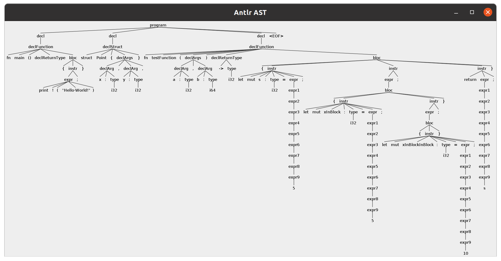
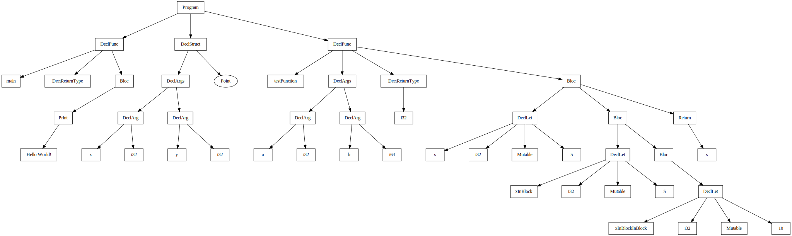

# Rust Compiler Project

The goal of this project is to create a translator for a subset of the Rust language, which we will call Mini Rust. The objective will be to write a lexical and syntax analyzer using Antlr, then a semantic analyzer, and to translate the Mini Rust code into C language. 

This project is a group project done in Telecom Nancy, french engineering school. The project is implemented in Java with Antlr. The original subject is available in French [here](MiniRUST.md).
## Table of contents
* [Features](#features)
* [Installation](#installation)
* [Contributing](#contributing)
* [License](#license)


## Features
To show all the features, we will use the [following example](examples/prog_example.rs).
### Grammar
The grammar is available [here](rust.g4). It is written in Antlr4.
### Lexical and syntax analyzer
The lexical and syntax analyzer is available [here](RustLexer.java) and [here](RustParser.java). It is generated by Antlr4. You can then visualize the syntax tree :

### Abstract syntax tree
We used the visitor pattern to generate the abstract syntax tree. You can visualize the abstract syntax tree :

### Table of symbols
We created a table of symbols to store the variables and functions. It helps for the semantic controls. Here is the ToS :
```agsl
Region : 0 Imbrication : 0
Symbols :
    (Bloc) | Region : 1 | Imbr : 1
    (Function) | name : main | returnType :   | typeParams :
    (Param) | name : a | type :  i32
    (Param) | name : b | type :  i64
    (Bloc) | Region : 2 | Imbr : 1
    (Function) | name : testFunction | returnType :  i32 | typeParams : (i32,i64)
Parent : (Root)

Region : 1 Imbrication : 1
Symbols :
Parent : (Bloc) | Region : 0 | Imbr : 0

Region : 2 Imbrication : 1
Symbols :
    (Var) | name : s | type : i32 | mutable : true
    (Bloc) | Region : 3 | Imbr : 2
Parent : (Bloc) | Region : 0 | Imbr : 0


Region : 3 Imbrication : 2
Symbols :
    (Var) | name : xInBlock | type : i32 | mutable : true
    (Bloc) | Region : 4 | Imbr : 3
Parent : (Bloc) | Region : 2 | Imbr : 1

Region : 4 Imbrication : 3
Symbols :
    (Var) | name : xInBlockInBlock | type : i32 | mutable : true
Parent : (Bloc) | Region : 3 | Imbr : 2
```
### Semantic analyzer
The semantic analyzer is done at the same time as the table of symbols. There are only few sematic controls done here. Feel free to add more.
## Installation

Use a Java Environnement to run the project.
### Compile the project
```bash
make setup
```

### Generate Syntax Tree
```bash
make st target={target}
```

### Generate Abstract Syntax Tree
```bash
make ast target={target}
```

### Run Rust code
```bash
make runcode target={target}
```

## Contributing
Pull requests are welcome. Final goal is to translate Rust code to C. For major changes, please open an issue first
to discuss what you would like to change.

## License
[Licence](LICENSE)
